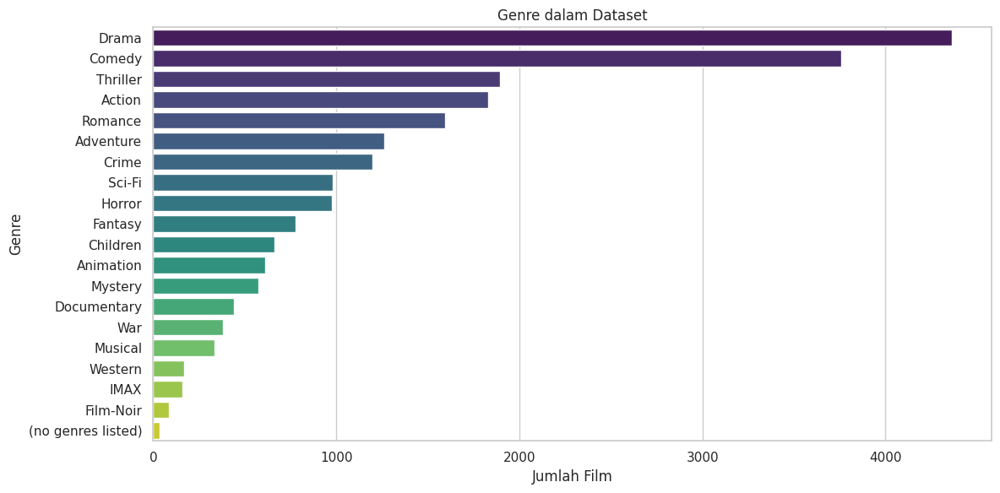
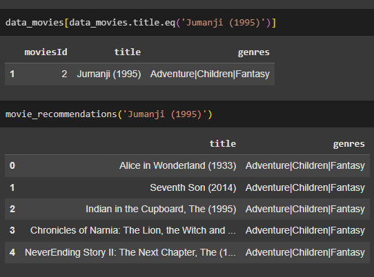
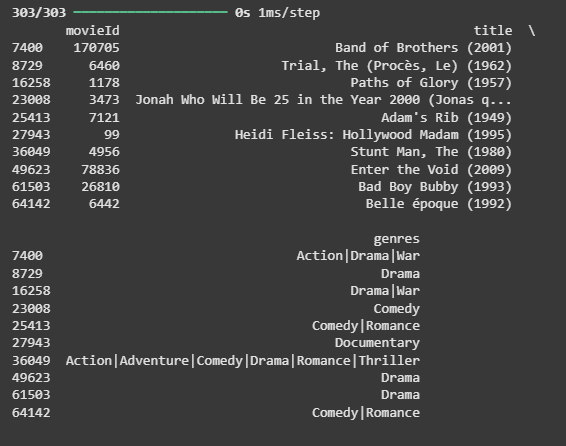
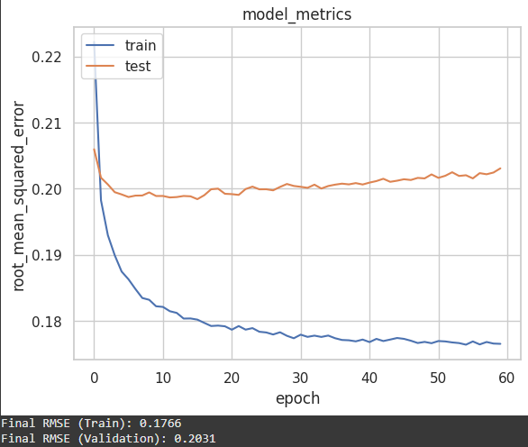

# Laporan Project Akhir Machine Learning Terapan Sistem Rekomendasi

## Latar Belakang  
Pada era digital di mana arus informasi dan data bergerak dengan sangat cepat, pengguna internet kerap kali  
dihadapkan pada banyaknya pilihan konten dalam hal hiburan seperti film. Dengan banyaknya film yang tersedia,  
kerap kali pengguna merasa kesulitan dalam menentukan film yang cocok dengannya.

Pengalaman pengguna menjadi faktor yang sangat penting untuk menarik pelanggan agar mereka dapat menemukan  
informasi yang mereka inginkan dengan mudah [1]. Ketika pengguna tidak menemukan informasi atau produk yang  
dimaksud, mereka akan beralih pada aplikasi lain atau bahkan menceritakan pengalaman buruk mereka kepada  
orang lain [2].

Melalui proyek ini, dikembangkan sistem rekomendasi film dengan pendekatan content-based filtering  
yang melibatkan preferensi pengguna berdasarkan genre dan collaborative filtering yang memanfaatkan data  
rating untuk memprediksi preferensi pengguna terhadap film lain.

## Business Understanding

### Problem Statement  
Berdasarkan latar belakang yang sudah disampaikan, terdapat beberapa rumusan masalah yang akan diselesaikan pada proyek ini:  
1. Bagaimana cara membangun sistem rekomendasi dengan algoritma content-based filtering berdasarkan genre?  
2. Bagaimana cara membangun sistem rekomendasi dengan algoritma collaborative filtering berdasarkan rating pengguna?  
3. Bagaimana kinerja dari algoritma content-based filtering dan collaborative filtering yang dibuat?

### Goals  
1. Mengetahui cara membangun sistem rekomendasi dengan algoritma content-based filtering berdasarkan genre.  
2. Mengetahui cara membangun sistem rekomendasi dengan algoritma collaborative filtering berdasarkan aktivitas rating yang diberikan pengguna.  
3. Mengetahui kinerja dari algoritma content-based filtering dan collaborative filtering yang dibuat.

### Solution Statement  
Untuk mencapai tujuan dalam studi kasus ini, dilakukan beberapa tahapan solusi sebagai berikut:  
1. Membangun sistem rekomendasi dengan algoritma content-based filtering, dalam proyek ini akan memanfaatkan informasi  
   fitur genre. Setiap film akan direpresentasikan dengan vektor fitur TF-IDF, dan rekomendasi diberikan berdasarkan  
   kemiripan antara film yang dipilih menggunakan metrik kemiripan cosine similarity.  
2. Membangun sistem rekomendasi dengan algoritma collaborative filtering menggunakan pendekatan berbasis model machine  
   learning dengan memanfaatkan data rating pengguna terhadap film.  
3. Melakukan pengujian menggunakan metrik Precision untuk menguji kinerja algoritma content-based filtering dan  
   menggunakan metrik Root Mean Square Error (RMSE) pada collaborative filtering.

## Data Understanding  
Dataset yang digunakan pada proyek ini diambil dari  
https://www.kaggle.com/datasets/nicoletacilibiu/movies-and-ratings-for-recommendation-system

### Deskripsi Dataset  
Dataset yang digunakan terdiri dari 2 dataset, yaitu dataset movies dan dataset ratings.  
Berikut adalah penjelasan kolom-kolom dari setiap data:

#### Data Movies  
Data Movies terdiri dari 9.742 baris data dan 3 kolom, yang merepresentasikan beberapa informasi mengenai film.  
- **movieId**: menyimpan data id unik film.  
- **title**: menyimpan data judul film beserta tahun rilis.  
- **genres**: menyimpan data genre film. Kolom ini menyimpan beberapa genre sekaligus yang  
  dipisahkan dengan tanda "|".  

#### Data Ratings  
Data Ratings terdiri dari 100.836 baris data dan 4 kolom, yang merepresentasikan beberapa informasi mengenai rating film.  
- **userId**: menyimpan data id unik pengguna.  
- **movieId**: menyimpan data id unik film.  
- **rating**: nilai rating yang diberikan pengguna terhadap film (dalam skala 0.5 – 5.0).  
- **timestamp**: menyimpan waktu (dalam format UNIX timestamp) saat rating diberikan.  

#### Variabel-variabel di dalam dataset  

##### Data Movies  
- Data Integer: movieId  
- Data Object: title, genres  

##### Data Ratings  
- Data Integer: userId, movieId, timestamp  
- Data Float: rating  

#### Missing Value, Data Duplikat, Outlier  
- Tidak ditemukan missing value di dalam dataset.  
- Tidak ditemukan outlier di dalam dataset.  
- Ditemukan beberapa duplikasi data judul di dalam dataset movies.  

## Univariate Data Analysis  
Analisis univariat dilakukan untuk memahami distribusi masing-masing variabel secara individual. Beberapa temuan awal:

### Analisis Persebaran Genre Film  
  
- Terdapat 20 genre unik di dalam dataset.  
- Drama adalah genre yang paling banyak muncul, diikuti oleh Comedy dan Thriller.  
- Genre seperti Film-Noir dan Western tergolong langka.  
- Terdapat 34 film tanpa genre yang tercantum, sehingga perlu dilakukan penghapusan karena model content-based filtering  
  yang akan dibangun berdasarkan genre.

### Analisis Persebaran Rating yang Diberikan Pengguna  
  
- Mayoritas pengguna cenderung memberikan rating moderat (antara 3.0 hingga 4.0), dengan 4.0 sebagai rating terbanyak.  
- Rating sempurna (5.0) cukup sering diberikan pengguna jika dibandingkan dengan rating-rating rendah.

### Analisis Film yang Mendapatkan Rating Terbanyak  
  
- Sebagian besar film yang mendapatkan rating terbanyak dirilis pada tahun 1990-an.  
- Film lama cenderung memiliki rating lebih banyak.

## Data Preparation  
- Menghapus data movies yang memiliki nilai '(no genres listed)'.  
- Menggabungkan data movies dan ratings untuk mendapatkan informasi mengenai film dan rating.  
- Menghapus data film yang memiliki duplikasi pada data title.  

### Data Preparation untuk Algoritma Content-Based Filtering

- Data Formatting / Data Structuring : Pada tahap ini, data film disusun ulang agar menjadi format yang terstruktur dan 
konsisten. Data seperti `movieId`, `title`, dan `genres` digabungkan dan diselaraskan sehingga memudahkan proses 
pemrosesan selanjutnya dalam sistem rekomendasi.
- Stopword Removal : Kata-kata umum (stopwords) dalam bahasa Inggris dihapus dari teks genre menggunakan pustaka 
pemrosesan bahasa alami agar hanya tersisa kata-kata yang memiliki makna penting dalam konteks genre film.
- Tokenization dan TF-IDF Vectorization : Kolom `genres` dipecah menjadi token-token (kata) individual, lalu dihitung 
bobot TF-IDF (Term Frequency-Inverse Document Frequency) menggunakan `TfidfVectorizer` dari scikit-learn. Teknik ini 
mengubah data teks genre menjadi representasi numerik yang memperhatikan frekuensi relatif dan kepentingan setiap token 
dalam keseluruhan data, sehingga menghasilkan matriks fitur yang dapat digunakan untuk mengukur kemiripan antar film.
- Ekstraksi Fitur Nama : Daftar token unik (fitur) yang dihasilkan oleh TF-IDF diambil dan digunakan sebagai label kolom 
pada matriks. Hal ini memudahkan interpretasi dan analisis fitur genre film.
- Konversi Sparse Matrix ke Dense Matrix : Matriks TF-IDF yang awalnya dalam format sparse diubah menjadi dense matrix 
agar data dapat ditampilkan secara lengkap dan mudah dianalisis.
- Penyusunan Matriks TF-IDF dalam DataFrame : Matriks TF-IDF kemudian dibungkus ke dalam sebuah DataFrame dengan baris 
berlabel judul film (`title`) dan kolom berlabel token genre, sehingga hasilnya mudah untuk divisualisasikan dan 
dianalisis secara lebih mendalam.

### Data Preparation untuk Algoritma Collaborative Filtering  
- Menghapus kolom `timestamp` : Kolom `timestamp` dihapus karena tidak relevan dalam membangun sistem rekomendasi 
berbasis rating. Informasi waktu tidak digunakan dalam model ini sehingga kolom tersebut dibuang untuk menyederhanakan data.
- Data Encoding pada `userId` dan `movieId`: Nilai asli `userId` dan `movieId` diubah menjadi bentuk numerik yang terurut 
(dari 0 hingga N-1) menggunakan teknik encoding. Hal ini diperlukan agar data dapat langsung digunakan sebagai input pada 
model machine learning, terutama untuk embedding layer pada metode collaborative filtering.
- Menghitung jumlah pengguna dan film unik : Jumlah pengguna dan film yang unik dihitung untuk menentukan dimensi 
embedding dan struktur model yang akan dibangun.
- Konversi tipe data `rating` menjadi `float32` : Tipe data rating dikonversi menjadi `float32` untuk mengoptimalkan 
penggunaan memori dan memastikan kompatibilitas dengan framework machine learning seperti TensorFlow saat proses 
pelatihan model.
- Mengetahui rentang nilai rating : Nilai minimum dan maksimum rating diperiksa untuk memahami distribusi skor serta 
sebagai dasar pertimbangan apakah perlu dilakukan normalisasi data sebelum pelatihan.
- Pengacakan data (shuffling) : Data pada `ratings_new` diacak urutannya untuk menghindari model mempelajari pola urutan 
yang tidak relevan. Pengacakan ini penting agar model dapat melakukan generalisasi dengan baik dan menghindari bias 
terhadap urutan data asli.
- Mapping ID ke indeks numerik berurutan : `userId` dan `movieId` asli dimapping ke indeks numerik yang berurutan mulai dari 
0 sampai N-1. Ini memastikan bahwa setiap user dan movie memiliki representasi numerik yang konsisten untuk input model.
- Min-Max Normalization : melakukan min-max normalization pada kolom `rating` untuk mengonversi nilai menjadi diantara 0 dan 1.
- Pembagian data menjadi train dan validation set : Data dibagi menjadi dua bagian: 80% untuk data pelatihan (training) 
dan 20% untuk data validasi. Pembagian ini berguna untuk mengevaluasi performa model secara objektif pada data yang 
tidak terlihat selama pelatihan.

## Modeling  

### Model Content-Based Filtering  
Model Content-Based Filtering dibangun dengan fungsi `movie_recommendations` yang digunakan untuk memberikan rekomendasi film  
berdasarkan kemiripan konten (genre) menggunakan cosine similarity.  
- Menggunakan matriks TF-IDF yang telah dibentuk dari data genre.
- Menghitung kemiripan antar film menggunakan cosine similarity dari scikit-learn (cosine_similarity).
- Cosine similarity menghasilkan matriks kemiripan antara setiap pasangan film berdasarkan genre.
- Untuk setiap film yang ditonton/rated pengguna, sistem akan mencari film dengan skor kemiripan tertinggi.
- Fungsi menerima judul film sebagai input utama untuk pencarian rekomendasi.  
- Mengambil nilai skor kemiripan antara film input dengan semua film lainnya dari matriks cosine similarity (similarity_data).  
- Mengidentifikasi dan memilih k film dengan skor kemiripan tertinggi sebagai kandidat rekomendasi.  
- Mengecualikan film yang menjadi input agar tidak direkomendasikan kembali kepada pengguna.  
- Menggabungkan daftar film hasil rekomendasi dengan data atribut film seperti judul dan genre untuk menampilkan informasi lengkap kepada pengguna.  
- Berikut ini adalah contoh hasil rekomendasi film yang didapatkan  

## Model Colaborative Filtering
Collaborative Filtering adalah metode sistem rekomendasi yang didasarkan pada pola interaksi antara pengguna dan item, 
tanpa melihat konten dari item tersebut. Pada proyek ini, digunakan pendekatan Neural Collaborative Filtering dengan 
membangun model menggunakan Keras Subclassing API.
- Model terdiri dari dua layer embedding untuk `userId` dan `movieId`, masing-masing berdimensi 50.
- Hasil dari embedding kemudian digabung (concatenate) dan diteruskan ke layer `Dense` dengan aktivasi `relu`.
- Output layer menggunakan satu neuron dengan aktivasi `sigmoid` untuk menghasilkan prediksi dalam rentang 0 hingga 1.
- Model dilatih menggunakan fungsi loss `Binary Crossentropy`, yang sesuai untuk prediksi biner seperti like atau dislike.
- Optimizer yang digunakan adalah Adam dengan learning rate 0.001.
- Pelatihan dilakukan selama 60 epoch dengan batch size 8, menggunakan data training dan validation.

Berikut adalah contoh hasil rekomendasi film yang diperoleh dari model, berdasarkan input `userId` yang dipilih secara acak:

## Evaluasi 
### Evaluasi Content-Based Filtering
**Precision** adalah matriks evaluasi kinerja model sistem rekomendasi yang mengukur seberapa banyak rekomendasi yang diberikan oleh sistem benar-benar relevan atau sesuai dengan preferensi pengguna. Secara matematis :

$$
\text{Precision} = \frac{\text{Jumlah item relevan yang direkomendasikan}}{\text{Jumlah total item yang direkomendasikan}}
$$

#### Alasan Memilih Precision sebagai Metrik Evaluasi

1. Fokus pada kualitas rekomendasi yang diberikan
   Precision menilai seberapa tepat rekomendasi yang muncul. Dalam konteks content-based filtering, rekomendasi yang akurat sangat penting agar pengguna merasa puas dan sistem dianggap bermanfaat.
2. Mudah dipahami dan diinterpretasikan
   Precision memberikan gambaran langsung berapa banyak rekomendasi yang benar-benar relevan dibanding total rekomendasi yang diberikan. Nilai precision yang tinggi menunjukkan kualitas rekomendasi yang baik.
3. Relevan untuk kasus rekomendasi dengan daftar terbatas
   Dalam banyak kasus, sistem rekomendasi hanya menampilkan sejumlah kecil item (misal top 5 atau top 10). Precision cocok digunakan untuk menilai performa dalam skala kecil tersebut.
4. Tidak bergantung pada total jumlah item relevan di database

   Berbeda dengan recall yang membutuhkan data lengkap tentang semua item relevan, precision hanya fokus pada hasil 
rekomendasi yang muncul. Ini memudahkan evaluasi terutama ketika data lengkap sulit diketahui.

- Evaluasi dilakukan dengan menjalankan fungsi movie_recommendations('Jumanji (1995)') untuk menghasilkan daftar film 
yang direkomendasikan berdasarkan kemiripan genre. Kemudian, dilakukan penghitungan precision untuk menilai seberapa 
relevan rekomendasi tersebut. Relevansi diukur dengan membandingkan apakah setiap film rekomendasi mengandung semua 
genre dari film "Jumanji (1995)".
- Rekomendasi dibatasi pada nilai k=5 film teratas, berdasarkan hasil yang didapatkan, terdapat 5 film yang memiliki 
genre yang sama dengan 
('Jumanji (1995)' sehingga perhitungannya menjadi Precision = 5/5
- Berdasarkan hasil evaluasi, sistem menghasilkan precision sebesar 100%, dimana semua film yang direkomendasikan 
seluruhnya mengandung genre yang sama dengan film 'Jumanji (1995)', yang menunjukkan bahwa seluruh film yang 
direkomendasikan memiliki genre yang sesuai dengan genre film acuan. Dengan kata lain, semua rekomendasi dianggap 
relevan dalam konteks genre, yang menunjukkan bahwa sistem bekerja secara efektif dalam mencocokkan konten film 
berdasarkan informasi genre.

### Evaluasi Collaborative filtering
**Root Mean Squared Error (RMSE)** dipilih sebagai metrik evaluasi untukmodel collaborative filtering ini. RMSE 
memberikan gambaran seberapa besar rata-rata kesalahan prediksi model dibandingkan rating asli dari pengguna, dengan 
satuan yang sama seperti rating.

Rumus RMSE:

$$
\text{RMSE} = \sqrt{\frac{1}{N} \sum_{i=1}^N (y_i - \hat{y}_i)^2}
$$

di mana:

- $y_i$ adalah rating asli,
- $\hat{y}_i$ adalah rating prediksi,
- $N$ adalah jumlah data.

#### Hasil Evaluasi
- Nilai Final RMSE (Train) sebesar 0.1766 menunjukkan bahwa model mampu memprediksi rating film dengan kesalahan 
rata-rata sekitar 0.18 poin pada data pelatihan. Ini menandakan model sudah belajar dengan baik dari data training.
- Nilai Final RMSE (Validation) sebesar 0.2031 menunjukkan performa model pada data yang belum pernah dilihat selama 
pelatihan. Nilai ini hanya sedikit lebih tinggi dibandingkan RMSE training, yang berarti model mampu melakukan 
generalisasi dengan baik dan tidak mengalami overfitting yang signifikan.
- Secara keseluruhan, nilai RMSE di bawah 0.3 pada skala rating 1–5 menunjukkan model memberikan prediksi yang cukup 
- akurat dan dapat diandalkan untuk merekomendasikan film sesuai preferensi pengguna.

- 
## Penyelesaian Permasalahan
1. Algoritma Content Based Filtering dibangun berdasarkan genre film. Proses dimulai dengan pembersihan data genre, lalu dilakukan 
ekstraksi fitur menggunakan teknik TF-IDF untuk merepresentasikan genre dalam bentuk numerik. Kemudian, cosine similarity 
digunakan untuk mengukur kemiripan antar film. Dengan pendekatan ini, sistem dapat merekomendasikan film yang memiliki 
kemiripan genre dengan film yang disukai pengguna sebelumnya, tanpa memerlukan interaksi pengguna lain.
2. Algoritma Collaborative filtering dibangun menggunakan pendekatan machine learning berbasis neural collaborative 
filtering. Model dikembangkan menggunakan embedding layer untuk mempelajari representasi laten dari pengguna dan film 
berdasarkan data rating yang tersedia. Dot product dari embedding digunakan untuk memprediksi rating yang mungkin 
diberikan oleh pengguna terhadap film yang belum ditonton, memungkinkan sistem memberikan rekomendasi berdasarkan pola 
perilaku pengguna lain.
3. - Content-Based Filtering dievaluasi menggunakan Precision, yang menilai seberapa relevan rekomendasi yang diberikan 
sistem terhadap preferensi pengguna. Algoritma content based filtering berhasil merekomendasikan film lain dengan tingkat 
precision yang tinggi. 
   - Collaborative Filtering dievaluasi menggunakan Root Mean Squared Error (RMSE) untuk mengukur seberapa dekat prediksi 
   sistem dengan nilai rating aktual. Algoritma Collaborative filtering yang dibangun berhasil mencapai nilai RMSE yang cukup baik. 
   
## Kesimpulan
Berdasarkan hasil implementasi dan evaluasi, sistem rekomendasi film yang dibangun melalui pendekatan content-based 
filtering dan collaborative filtering menunjukkan performa yang cukup baik dalam memberikan rekomendasi sesuai preferensi 
pengguna. Pendekatan content-based filtering mampu merekomendasikan film berdasarkan kesamaan genre dengan film yang 
disukai pengguna, dengan hasil evaluasi precision menunjukkan relevansi yang cukup tinggi. Sementara itu, pendekatan 
collaborative filtering yang menggunakan model neural network berhasil mempelajari pola perilaku pengguna dan memprediksi 
rating dengan akurasi yang baik, ditunjukkan melalui nilai RMSE yang rendah. Kedua pendekatan ini saling melengkapi dan 
membuka peluang untuk pengembangan sistem hybrid di masa depan, guna menghasilkan rekomendasi yang lebih akurat dan 
personal. Dengan demikian, sistem ini diharapkan dapat membantu pengguna dalam menemukan film yang sesuai dengan minat 
mereka, serta meningkatkan pengalaman dan keterlibatan pengguna dalam platform.

## Referensi
[1] R. A. Grewala D, “Understanding Retail Experiences and Customer Journey,” J Retailing
96, no. http://dx.doi.org/10.1016/j.jretai.2020.02.002 , p. 3–8, 2020. 
 
[2] K. Lukita, M. Galinium dan J. Purnama, dalam Seminar Nasional Pakar ke , 2018. 

